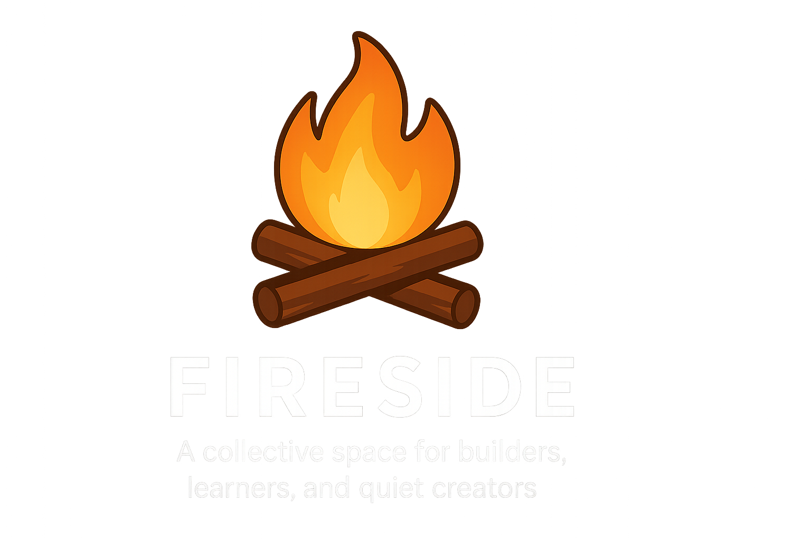

  

Fireside started as a Discord server during the 2020 lockdown — a place to pass time through games, watch parties, and spontaneous chaos. Over time, it grew into something more: a shared corner for making things, learning in public, and building without pressure.

This org hosts the code side of that story.

---

## What We Do

Fireside isn't a startup. It’s not a bootcamp. It's just a place where people who like working on ideas—big or small—hang out and build stuff.

You'll find:

- 🛠️ Tiny tools and weekend projects  
- 🌐 Full-stack web experiments  
- 🧠 ML prototypes and geospatial analysis  
- 🕹️ Games and interactive experiments  
- 📚 Docs, writeups, and visual explainers  

Explore our [projects](https://github.com/orgs/TheFireside/repositories) →  
They're public by default, open to explore, fork, remix, or contribute to.

---

### 📜 Code of Conduct

This space runs on mutual respect, kindness, and shared curiosity.  
Read our [Code of Conduct](./CODE_OF_CONDUCT.md) before contributing — it's short, and it matters.

---

## What We Value

- **Build without pressure** — No deadlines, no grind.
- **Learn in the open** — Even messy work teaches.
- **Start small** — Some of the best things begin that way.
- **Be decent** — Respect others, give credit, write things down.
- **Stay curious** — That’s why we’re here.

---

## Get Involved

We hang out on [Discord](https://discord.gg/WB9gxn7uke).  
No onboarding rituals — just jump into a thread, suggest something, or start building.

You don’t need to be “experienced.” You just need to be interested.

---

## Fireside, in a sentence?

> It's like a digital campfire for people who like to make things. Pull up a chair.
